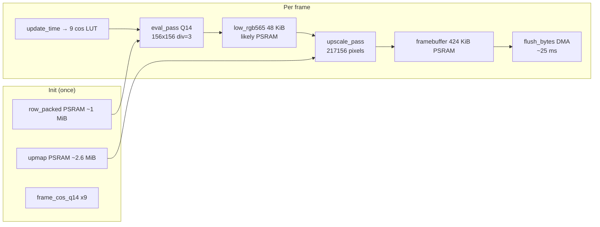

# Follow-Up Prompt for Higher-Capability Model

> **This is the master entry point.** Copy everything below `## PROMPT START` into a new chat.  
> **Repo:** `C:\Users\USER\pocket-watch-smoke-test`  
> **Doc index:** [`docs/README.md`](README.md)

---

## Documentation map (read in this order)

| Priority | Document | Why |
|----------|----------|-----|
| **1** | [`02-ANIMATION-BOTTLENECK.md`](02-ANIMATION-BOTTLENECK.md) | Physics of the problem — eval vs upscale vs flush, 10× math, ranked tiers |
| **2** | [`06-OPTIMIZATION-CHRONOLOGY.md`](06-OPTIMIZATION-CHRONOLOGY.md) | Every attempt so far — do not repeat failed paths |
| **3** | [`05-MEMORY-LINKER.md`](05-MEMORY-LINKER.md) | `low_rgb565` PSRAM placement, `dram2_seg` overflow, SRAM strategies |
| **4** | [`04-SHADER-MATH-MAPPING.md`](04-SHADER-MATH-MAPPING.md) | GLSL↔Rust fidelity contract — safe vs unsafe optimizations |
| **5** | [`01-PROJECT-HANDOFF.md`](01-PROJECT-HANDOFF.md) | Hardware, pins, PMIC, QSPI, module reference, footguns (reference) |
| **6** | [`07-PREBAKE-PIPELINE.md`](07-PREBAKE-PIPELINE.md) | Video fallback — **only if live path stalls after Tier S** |

---

## The problem (one paragraph)

We ported the [21st.dev Raidal-2](https://21st.dev) WebGL aurora shader to a **no_std Rust** firmware on **Waveshare ESP32-S3-Touch-AMOLED-1.75** (466×466 CO5300 QSPI AMOLED). Display bring-up is **done**. Gen 5 two-pass Q14 + integer upscale is **profiled and stable at ~1.0 FPS**. DMA flush is **solved (25 ms)**. **Eval dominates (798 ms, 77%)**; upscale is second (217 ms, 21%). We need **10× total frame speed → ~10 FPS (~104 ms/frame)** at **equal or better quality than div=3**, via **live mathematical shader evaluation** — this requires deep research and aggressive multi-pronged optimization, not incremental tweaks.

---

## Confirmed baseline (user serial log — Gen 5, `--release`, div=3)

```
=== Raidal-2 (WebGL parity) ===
Q14 eval + integer upscale | div=3
AXP2101: OK
QSPI DMA 8 KiB chunks @ 80 MHz
Building static cache + upscale map...
Init 498 ms | eval 156x156 | FB 424 KiB
First frame: 1043 ms
fps~1.0 eval=799ms upscale=217ms flush=25ms total=1042ms
fps~1.0 eval=798ms upscale=217ms flush=25ms total=1041ms
(repeats stable ±1 ms)
```

### Frame budget breakdown (current → 10× target)

| Stage | Current | % of frame | 10× target | Required speedup |
|-------|---------|------------|------------|------------------|
| `eval_pass` | **~798 ms** | 77% | **≤ 80 ms** | **~10×** |
| `upscale_pass` | **~217 ms** | 21% | **≤ 22 ms** | **~10×** |
| `flush` | **~25 ms** | 2% | ~25 ms (fixed) | — |
| **total** | **~1042 ms** | — | **≤ 104 ms** | **~10×** |

**Render budget after flush at 10 FPS:** 104 − 25 = **79 ms** for eval + upscale combined (currently **1015 ms** → need **~12.8×** on render).

**Do not waste time re-profiling** unless you change the build — these numbers are authoritative.

---

## Architecture (current Gen 5)



**Key insight:** `RENDER_DIVISOR` only shrinks **eval** grid. **Upscale always touches 217,156 output pixels.** div=4 cut eval ~4× but total only ~2.5× because upscale stayed ~800 ms — and quality suffered.

---

## Decision tree (confirmed data — skip profiling)

```
BASELINE: eval=798ms upscale=217ms flush=25ms total=1042ms
│
├─ TRACK A: eval (798ms → ≤80ms) — PRIMARY, 77% of frame
│   ├─ Dual-core eval by pixel index (esp-hal multi-core / critical-section)
│   ├─ i32-only inner loop — eliminate i64 in eval_pixel_q14 + smoothstep + LUT
│   ├─ Reduce LUT calls — algebraically reuse cos_a for sin paths where valid
│   ├─ Row eval: keep row_pack in internal; minimize PSRAM row_packed memcpy
│   ├─ Xtensa-specific: #[inline(always)], loop structure, -C target-cpu=esp32s3
│   ├─ Research: esp-dsp sin/cos, assembly kernels, ESP-IDF perf examples
│   └─ Pipeline: eval next frame ‖ flush current (hide 25ms if eval still >25ms)
│
├─ TRACK B: upscale (217ms → ≤22ms) — SECONDARY, 21% of frame
│   ├─ YES confirmed slow → low_rgb565 almost certainly in PSRAM
│   │   → #[ram(reclaimed)] static LOW_RGB565[24336] (05-MEMORY-LINKER.md §5A)
│   ├─ Row-band upscale: process output rows with hot low rows in SRAM
│   ├─ On-the-fly bilinear indices — drop 2.6 MiB upmap if cache-thrashing
│   └─ Strip loop for I-cache locality
│
├─ STACK optimizations until total ≤ 104ms (10 FPS)
│   └─ No single trick achieves 10× — combine Tier S + A + research findings
│
└─ If live path still > 170ms after best effort → quantify gap, discuss 07-PREBAKE-PIPELINE.md
```

---

## PROMPT START

You are continuing an embedded Rust project: **Raidal-2 aurora shader on Waveshare ESP32-S3-Touch-AMOLED-1.75** (466×466 CO5300 QSPI AMOLED). The display works. Gen 5 shader is profiled at **~1.0 FPS** with stable split timings. I need **10× frame speed → ~10 FPS (~104 ms/frame)** at **equal or better visual quality** than today, keeping **live mathematical shader evaluation** as the primary approach (pre-baked video is back-burner only).

**This is a hard optimization problem.** A single change will not get 10×. You must **research extensively** before and during implementation — treat this like a performance-engineering sprint, not a quick patch.

### Required reading (in repo)

Read these **before** changing code:

1. [`docs/README.md`](README.md) — documentation index
2. [`docs/02-ANIMATION-BOTTLENECK.md`](02-ANIMATION-BOTTLENECK.md) — why div=4 failed, eval vs upscale vs flush, 10× math, ranked optimizations
3. [`docs/06-OPTIMIZATION-CHRONOLOGY.md`](06-OPTIMIZATION-CHRONOLOGY.md) — every optimization attempt + lessons
4. [`docs/05-MEMORY-LINKER.md`](05-MEMORY-LINKER.md) — buffer placement, `dram2_seg` overflow
5. [`docs/04-SHADER-MATH-MAPPING.md`](04-SHADER-MATH-MAPPING.md) — GLSL↔Rust fidelity contract
6. [`docs/01-PROJECT-HANDOFF.md`](01-PROJECT-HANDOFF.md) — hardware, pins, PMIC, QSPI, code map, footguns
7. [`docs/07-PREBAKE-PIPELINE.md`](07-PREBAKE-PIPELINE.md) — video fallback (**only if live path stalls**)

### Hardware summary

- **ESP32-S3R8** (per official Waveshare page): dual-core 240 MHz, **Built-in 512KB SRAM and 384KB ROM, with stacked 8MB PSRAM and external 16MB Flash**  
  (Note: "stacked" PSRAM is the standard integrated octal PSRAM on S3R8 modules; internal SRAM pool remains tight at 512 KiB total.)
- **Display**: CO5300 @ QSPI 80 MHz, RGB565, column offset **6**
- **PMIC**: AXP2101 I2C `0x34` — DC1 + ALDO1 @ 3.3 V required
- **Pins**: CS=12, SCK=38, SIO0-3=4,5,6,7, RESET=39, I2C SDA=15 SCL=14

### Current software

- `no_std` Rust, esp-hal ~1.1.1 + `unstable`, esp-alloc dual heap (48 KiB internal + PSRAM)
- `src/raidal.rs`: two-pass render — **Q14 fixed-point eval_pass** (div=3, 156×156) → **upscale_pass** (precomputed `UpPixel` integer bilinear) → byte framebuffer
- `src/qspi_bus.rs`: `flush_bytes` 8 KiB DMA chunks (~25 ms)
- `src/bin/main.rs`: logs `fps~ eval= upscale= flush= total=`
- `build.rs`: `SIN_LUT_I16` Q14 tables

### What is already solved (do NOT redo)

- Black screen (QSPI quad cmd `0x32`, addr `0x003C00`, GPIO 6/7, PMIC, CASET offset 6)
- DMA flush (~25 ms) — not the bottleneck
- Static cache for atan2 and inv_denom (`row_packed`)
- Per-frame cos(layer-t) — only **9** trig ops/frame
- Two-pass architecture with split timers

### Confirmed baseline (do not re-profile unless you change code)

```
fps~1.0 eval=798ms upscale=217ms flush=25ms total=1042ms
```

| Stage | Measured | % of frame | 10× target |
|-------|----------|------------|------------|
| `eval_pass` | **798 ms** | 77% | **≤ 80 ms** |
| `upscale_pass` | **217 ms** | 21% | **≤ 22 ms** |
| `flush` | **25 ms** | 2% | ~25 ms (solved) |
| **total** | **1042 ms** | — | **≤ 104 ms (~10 FPS)** |

- **div=4** hurt quality — do not use without my A/B approval
- **96 KiB heap** overflowed `dram2_seg` — use `#[ram(reclaimed)] static` for internal buffers
- Upscale at 217 ms (not 800 ms) — Gen 5 integer upmap works partially; `low_rgb565` likely still in PSRAM

### Research mandate (required before coding)

Spend real time researching. Do not jump straight to one fix. Investigate **all** of the following and cite what you apply:

1. **ESP32-S3 dual-core** — `esp-hal` second core startup, `critical-section`, splitting `eval_pass` by pixel index across cores, core pinning, avoiding cache contention on shared `row_packed` / `low_rgb565`
2. **Xtensa LX7 / LLVM** — `opt-level=3`, `lto=fat` (already in release), loop unrolling, `#[inline(always)]` on LUT/smoothstep, impact of `i64` vs `i32` on register pressure
3. **PSRAM vs internal SRAM** — pointer diagnostic for `low_rgb565`; `#[ram(reclaimed)]` static placement; row-band staging (Strategy D in `05-MEMORY-LINKER.md`); whether 2.6 MiB `upmap` thrashes cache during upscale
4. **Fixed-point / LUT tricks** — reuse `cos_a` for sin offsets; smaller LUT; `esp-dsp` or hand-written assembly for sin/cos; precompute more per-layer terms if algebra allows (see `04-SHADER-MATH-MAPPING.md` §11)
5. **Pipeline parallelism** — eval frame N while flushing frame N−1; double-buffered framebuffer
6. **Prior art** — embedded fragment shaders on MCU (STM32, RP2040, other ESP32-S3 demos), software rasterizer optimization patterns
7. **Web search** — "ESP32-S3 PSRAM optimization", "Xtensa fixed-point sin cos fast", "esp-hal dual core example", "ESP32-S3 SIMD esp-dsp"

Read the repo docs **and** external sources. Build a **written optimization plan** with expected gain per item before implementing. Then implement in priority order, measuring after **each** change.

### Your mission

Achieve **10× speedup on total frame time**: **1042 ms → ≤ 104 ms (~10 FPS)** while preserving WebGL Raidal-2 visual fidelity:

- 9 layers, smoothstep bands, per-channel sin (+0,+2,+4), tanh tone map per channel
- **No div≥4** unless I approve after A/B test
- **div=3 minimum quality** — div=2 acceptable if eval budget allows (higher quality)

Intermediate milestone: **≥ 6 FPS** (`total < 170 ms`) is useful but **not sufficient** — keep pushing toward 10 FPS.

### Prioritized implementation order (given confirmed timings)

1. **Research phase** — optimization plan with cited sources (30+ min of investigation)
2. **Track B quick win** — `low_rgb565` → internal SRAM (`#[ram(reclaimed)] static [u16; 24336]`); expect upscale 217 → ~30–50 ms
3. **Track A eval** — dual-core pixel-index split (~1.8× on eval alone → ~440 ms); stack with i32-only hot loop (~1.5–2× → ~220–290 ms)
4. **LUT / algebra** — reduce 36 LUT calls/pixel where fidelity-safe
5. **Pipeline** — eval‖flush to hide 25 ms flush
6. **Re-measure after each step** — paste serial logs; iterate until `total < 104 ms` or quantify remaining gap

### Success criteria (serial log)

**Primary (10×):**
```
fps~≥10.0 eval=<80ms upscale=<22ms flush=~25ms total=<104ms
```

**Intermediate (acceptable checkpoint):**
```
fps~≥6.0 eval=<100ms upscale=<30ms flush=~25ms total=<170ms
```

Visual parity checklist:

- No 4×4 blockiness (div=4 artifact gone)
- Aurora rotates smoothly
- Teal / violet / gold separation visible
- Soft band edges (not hard rings)
- tanh highlight roll-off

### Flash command

```powershell
cargo espflash flash --release --monitor
```

### Constraints

- Do not break display init sequence in `main.rs`
- Internal heap > 48 KiB may overflow `dram2_seg` — check linker map before growing heap
- `SpiDmaBus` copies chunks to internal DMA buf — zero-copy PSRAM DMA is optional stretch goal
- ESP32-S3 has **no GPU / no PPA** — all shader math is CPU
- Do not reduce layers, skip tanh, or use shared tanh — breaks WebGL look (user rejected)
- Dual-core **row** split failed (seam) — use **pixel index** split only

### Rejected approaches (do not retry without new evidence)

| Approach | Why rejected |
|----------|--------------|
| div≥4 | Visible blockiness on 466px round display |
| 96 KiB internal heap | Linker `dram2_seg` overflow by 24560 bytes |
| Dual-core row split | Bilinear seam at row boundary |
| Fewer layers / frame skip | Breaks WebGL aesthetic |
| Single-channel tanh | Breaks color separation |

### Deliverables

1. **Research summary** — what you investigated, what you rejected, what you applied (with links/references)
2. **Optimization plan** — expected ms savings per change against baseline `eval=798 upscale=217`
3. **Code changes** with measured before/after timings after **each** optimization (serial log paste)
4. Brief explanation of which tier (from `02-ANIMATION-BOTTLENECK.md` §10) you implemented and why
5. If 10 FPS unreachable live, quantify remaining gap in ms and propose smallest-quality-cost next step
6. **Implement yourself** — do not only advise. Build, flash `--release`, and reason from `src/raidal.rs`, `src/qspi_bus.rs`, `src/bin/main.rs`

## PROMPT END

---

## Optional context to paste with prompt

### Authoritative baseline (Gen 5, div=3, `--release`)

```
fps~1.0 eval=798ms upscale=217ms flush=25ms total=1042ms
```

### Performance history

| Build | eval | upscale | flush | total | FPS | Quality |
|-------|------|---------|-------|-------|-----|---------|
| div=2 fused | ~3975 ms | (fused) | 38 ms | ~4013 ms | 0.2 | Good |
| div=4 extreme | ~1599 ms | (fused) | 25 ms | ~1625 ms | 0.6 | **Degraded** |
| **div=3 Gen 5 (current)** | **798 ms** | **217 ms** | **25 ms** | **1042 ms** | **1.0** | OK |

### Work accounting (@ div=3, measured)

```
eval:     24,336 pixels × 9 layers × 4 LUT ≈ 875k LUT ops → 798 ms (≈912 ns/op effective)
upscale:  217,156 pixels × 4 gathers        ≈ 868k reads  → 217 ms (≈1000 ns/read — PSRAM?)
flush:    424 KiB → 25 ms (solved, 2% of frame)
```

### 10× math from confirmed baseline

```
Current:  1042 ms/frame = 1.0 FPS
Target:   104 ms/frame  = 10.0 FPS  (10× total)

Render budget at 10 FPS: 104 - 25 flush = 79 ms for eval+upscale
Current render: 798 + 217 = 1015 ms → need 12.8× on eval+upscale

Per-stage 10× targets:
  eval:    798 → 80 ms
  upscale: 217 → 22 ms
```

No single 10× lever exists. Cumulative plan required (e.g. 2× dual-core × 2× i32 × 2× LUT reduction × 1.3× pipeline ≈ 10×).

### Code hot path locations

| Function | File | Notes |
|----------|------|-------|
| `eval_pass` | `raidal.rs:148` | Row copy from PSRAM, Q14 eval per pixel |
| `eval_pixel_q14` | `raidal.rs:189` | i64 accumulators, 36 LUT calls/pixel |
| `upscale_pass` | `raidal.rs:165` | 217k iterations, 4× gather from `low_rgb565` |
| `render_timed` | `main.rs:192` | Split timers |
| `flush_bytes` | `qspi_bus.rs:77` | 8 KiB DMA chunks |

### User preferences

- **10× frame speed** from confirmed **1.0 FPS → ~10 FPS** (~104 ms/frame)
- **Research deeply** — this is not a one-line fix; investigate ESP32-S3, dual-core, PSRAM, LUT, assembly
- **Live shader math** over pre-baked video (video is back-burner)
- **Quality ≥ div=3** — div=4 was too blocky
- Loves the animation aesthetic — preserve WebGL look

---

*Master entry prompt — Turn 3 of 3 — Jul 2026*  
*See [`README.md`](README.md) for full documentation index.*