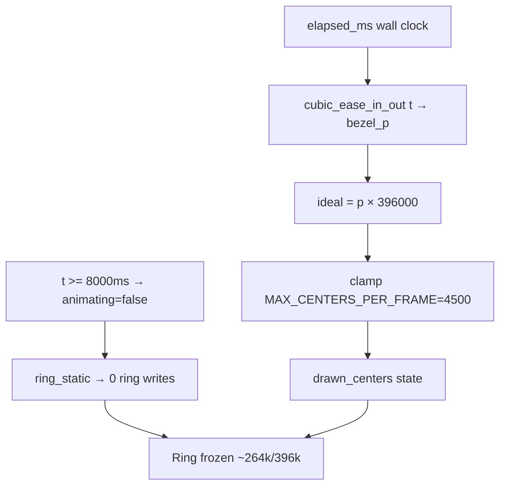
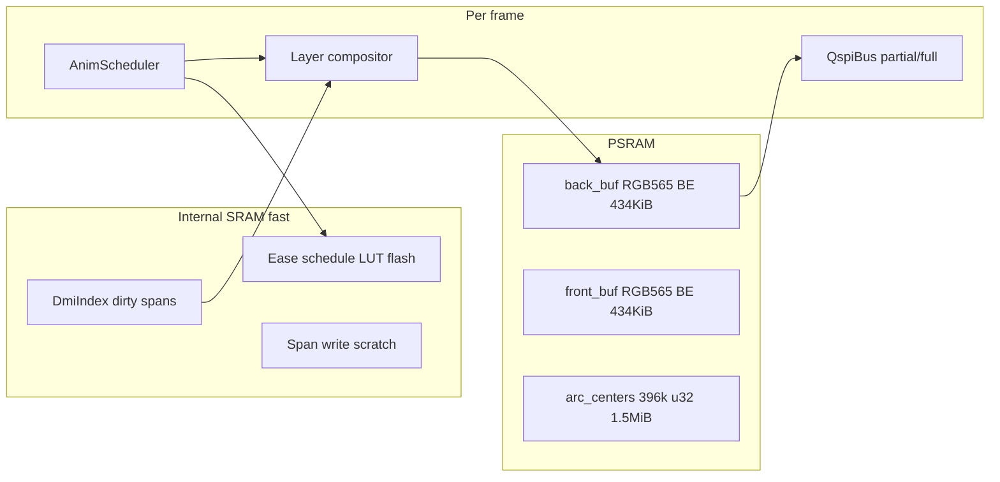
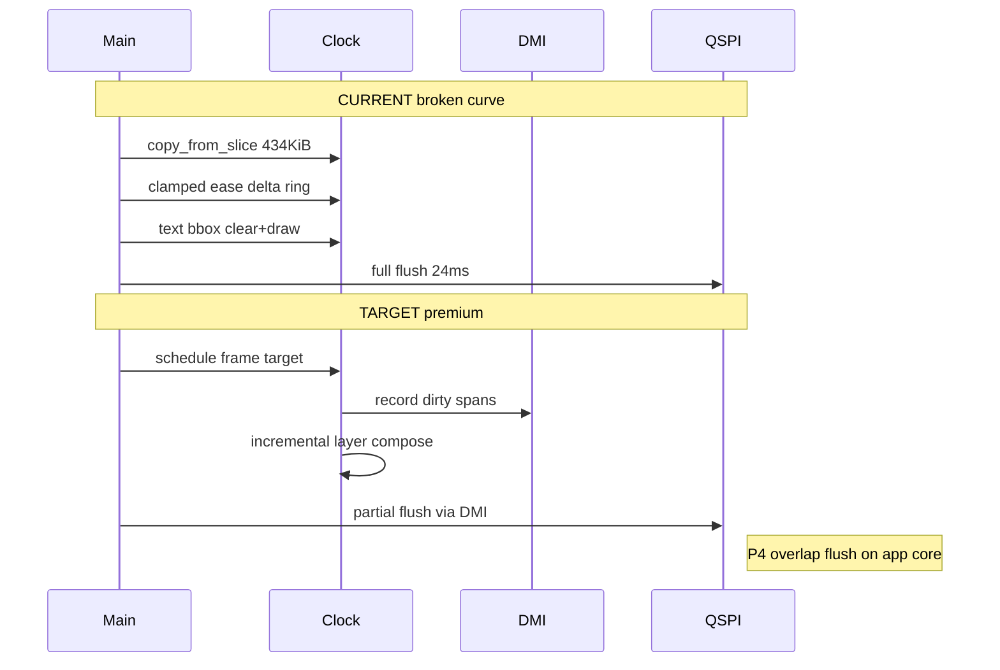

# Bespoke Framebuffer + Premium Animation — Master Prompt

> **This is the master entry point for the pocket-watch OS display stack.**  
> Copy everything below `## PROMPT START` into a new chat (Claude Fable or equivalent).  
> **Repo:** `C:\Users\USER\pocket-watch-smoke-test` · **Branch:** `time-display`  
> **Doc index:** [`docs/README.md`](README.md)

---

## Documentation map (read in this order)

| Priority | Document | Why |
|----------|----------|-----|
| **1** | **This file** (`09-BESPOKE-FRAMEBUFFER-PROMPT.md`) | Mission, architecture, implementation phases |
| **2** | [`08-TIME-DISPLAY-HANDOFF.md`](08-TIME-DISPLAY-HANDOFF.md) | Full chronology of ring/time display attempts + profiling |
| **3** | [`05-MEMORY-LINKER.md`](05-MEMORY-LINKER.md) | PSRAM vs SRAM, buffer sizes, dram2 overflow |
| **4** | [`02-ANIMATION-BOTTLENECK.md`](02-ANIMATION-BOTTLENECK.md) | Three clocks (render / flush / total), DMA floor |
| **5** | [`06-OPTIMIZATION-CHRONOLOGY.md`](06-OPTIMIZATION-CHRONOLOGY.md) | Failed paths — do not repeat |
| **6** | [`01-PROJECT-HANDOFF.md`](01-PROJECT-HANDOFF.md) | Hardware, CO5300 QSPI, PMIC, pins |

---

## PROMPT START

You are implementing a **premium watch-grade display stack** for a pocket-watch operating system on **Waveshare ESP32-S3-Touch-AMOLED-1.75** (466×466 round CO5300 QSPI, ESP32-S3R8, 8 MiB PSRAM).

**Do not use GIF or JPEG.** Render live vector graphics (lines, text, layers) in Rust (`no_std` + `esp-hal`). Take **engineering inspiration** from Larry Bank's embedded libraries ([AnimatedGIF](https://github.com/bitbank2/AnimatedGIF), [JPEGDEC](https://github.com/bitbank2/JPEGDEC), [DMA blog](https://bitbanksoftware.blogspot.com/2025/03/how-to-speed-up-your-project-with-dma.html)) — callback pipelines, no malloc in hot paths, render-while-DMA-transmits — but implement a **custom bespoke framebuffer** suited to watch UI.

### Immediate bug to fix (P0)

The bezel ring animation **stops at ~2/3** of the circle and does **not** follow the intended cubic ease curve. Root cause is documented in [`08-TIME-DISPLAY-HANDOFF.md`](08-TIME-DISPLAY-HANDOFF.md) § "ring stops at 2/3":

1. `MAX_CENTERS_PER_FRAME = 4500` rate-limits visual progress while cubic ease demands **2–3× more** centers/frame in the middle third.
2. Phase exits on **wall-clock** (`BEZEL_INITIAL_MS = 8000`) not on **completion** (`drawn_centers == 396000`).
3. `ring_static = true` freezes the incomplete ring.

**P0 must:** complete the ring with correct S-curve feel at stable ~11 FPS before building the full `WatchFb` module.

### Confirmed hardware baseline (authoritative — do not re-profile unless build changes)

```
Clock ready 576 ms | bezel anim=396000 full=19444 offsets | 2x FB 848 KiB PSRAM
clock fps~11.0 render=66ms flush=24ms total=91ms | centers=19444 cdelta=0 px_writes=0  (static, good)
```

| Stage | Measured | Target |
|-------|----------|--------|
| `flush` (full frame) | **~24 ms** | ≤24 ms full; **5–15 ms** partial (P3) |
| `render` (static) | **~66 ms** | **50–65 ms flat** (no ramp) |
| `total` | **~91 ms** | **~75–90 ms** → ~11 FPS consistent |
| PSRAM anim list | 396k centers × 4 B ≈ **1.5 MiB** | Keep ≤2 MiB |
| SRAM heap | **8 KiB** | **No malloc in hot path** |

**Bottleneck today:** render during anim (was 66→672 ms with prefix replay; incremental+cap fixed ramp but broke curve). Flush is **not** the anim problem.

---

## The problem (one paragraph)

We have a working digital clock UI (`src/clock.rs`) with Inter Display Bold text (scale-to-gray AA), a thick bezel ring (r≈223, 10px pad), and cubic ease-in-out sweep on startup + minute change. Double-buffered PSRAM framebuffers ping-pong through [`src/qspi_bus.rs`](src/qspi_bus.rs) DMA flush. After fixing render-time ramp via incremental deltas + `copy_from_slice`, FPS is stable ~11 — but the ring **stops ~66% complete** because per-frame center cap + wall-clock phase exit decouple visual progress from the ease curve. We need a **reusable bespoke framebuffer (`WatchFb`)** with **DMI partial updates**, **build-time animation schedules**, and **bitbank2-style pipeline overlap** so this display stack becomes the foundation of a full watch OS with Apple Watch / Wear OS quality on limited hardware.

---

## Root cause diagram (2/3 stop)



**Math:** 396000 centers / 88 frames @ 11fps×8s = 4500/frame average. Cubic ease-in-out peak derivative at t≈0.5 needs ~9000–13500/frame. Cap prevents catch-up → ~66% at phase end.

---

## Target architecture: WatchFb + DMI + AnimScheduler



### WatchFb — bespoke framebuffer compositor

A `no_std` module (proposed `src/watch_fb.rs`) that owns:

- **Two RGB565 big-endian buffers** in PSRAM (display-ready, no per-pixel swap)
- **Retained layer state** — ring pixels persist across frames without full `copy_from_slice`
- **Layer trait** — `damage()` returns dirty spans; `compose()` writes pixels
- **Zero heap allocation** in `compose()` / `flush()` hot paths

```rust
// Target API (conceptual — implement in P1)
pub struct WatchFb<'a> {
    back: &'a mut [u8],
    front: &'a [u8],
    dmi: DmiIndex,
    width: u16,
    height: u16,
}

pub trait Layer {
    fn damage(&self) -> &[Span];
    fn compose(&self, fb: &mut [u8], ctx: &ComposeCtx);
}

pub struct ComposeCtx {
    pub fade_q14: i32,
    pub frame_idx: u32,
}
```

**Layers for clock UI (v1):**

| Layer | Retained? | Damage per frame |
|-------|-----------|------------------|
| `BackgroundLayer` | Yes (black) | Never after prime |
| `BezelRingLayer` | Yes | Arc delta spans only during anim |
| `TextLayer` | No (fade) | Text bbox only |

### DMI — Dirty Metadata Index

**DMI** = compact SRAM index of dirty display regions for partial DMA flush.

```rust
// Proposed src/dmi.rs
#[repr(C)]
pub struct Span {
    pub y: u16,
    pub x0: u16,
    pub x1: u16,  // inclusive
}

pub struct DmiIndex {
    spans: [Span; MAX_SPANS],  // e.g. 256
    count: u16,
}
```

- Populated when ring arc grows/shrinks (convert center + 3×3 to row spans)
- Populated for text bbox clear + redraw
- **Coalesce** adjacent spans on same row where possible
- Overflow (>256 spans) → fall back to full-frame flush

**Partial flush (P3):** For each span, set CO5300 window via `0x2A`/`0x2B`, `0x2C`, DMA only `width×2` bytes from framebuffer slice. Round display: clip spans to visible disc if needed.

**Expected win:** Anim frames flush ~5–15 ms vs 24 ms full — major headroom for OS compositor.

### AnimScheduler — premium time curves

**Core principle:** Per-frame work is **scheduled**, not derived from `ease(t) × total` with a runtime cap.

#### Build-time ease schedule (P0/P2)

In `build.rs`, generate static tables in flash:

```rust
// OUT_DIR/watch_anim.rs (generated)
pub const INITIAL_SCHEDULE: &[u32] = &[0, 4500, 9200, ... 396000];  // cumulative centers
pub const UNDRAW_SCHEDULE: &[u32] = &[396000, 391000, ... 0];
pub const REDRAW_SCHEDULE: &[u32] = &[0, 4500, ... 396000];
```

Generation algorithm:

1. Choose `N = duration_ms × target_fps / 1000` frames (e.g. 8000×11/1000 ≈ 88)
2. For frame `i` in `0..N`, compute `t = i / (N-1)` in Q14
3. Apply **cubic ease-in-out** or **cubic Bezier** with watch-like control points:
   - CSS ease standard: `(0,0,0.25,0.1,0.75,0.9,1,1)` — smooth S-curve
   - Implement via Q14 De Casteljau or pre-sampled LUT (512 entries)
4. `schedule[i] = ease(t) × 396000` (cumulative center count, monotonic)
5. Per-frame delta: `schedule[i] - schedule[i-1]` — bounded by construction

#### Runtime rules (mandatory)

1. `target_centers = schedule[frame_in_phase]` — **no** `clamp_target` hack
2. **Phase completion:** do not enter `Static` until `drawn_centers == schedule.last()` OR one-shot deduped full blit (`19444` offsets)
3. **Catch-up frames:** if `frame_in_phase >= schedule.len()` but ring incomplete, extend phase (add catch-up frames at schedule end rate) — premium watches never freeze mid-anim
4. **Q14 only** in hot path — no `f32` in `apply_bezel_delta`
5. Remove `MAX_CENTERS_PER_FRAME` once schedule bounds deltas

#### Cubic Bezier reference (for build.rs host-side gen)

```
B(t) = (1-t)³P0 + 3(1-t)²t P1 + 3(1-t)t² P2 + t³ P3
P0=(0,0) P1=(0.25,0.1) P2=(0.75,0.9) P3=(1,1)
```

For arc length parameterization: sample 1024 points, build cumulative length LUT, map equal time steps to center indices.

---

## bitbank2 patterns → Rust mapping

Larry Bank achieves **22–31 FPS GIF** on ESP32-class devices (240×240 ILI9341 @ 40 MHz SPI) by overlapping decode with DMA. We adapt the **patterns**, not the codecs.

| bitbank2 (AnimatedGIF / JPEGDEC) | Our Rust equivalent | Phase |
|--------------------------------|---------------------|-------|
| `GIFDraw` line callback — decode 1 line, emit pixels | `SpanFlush::emit_row_span(y, x0, x1, rgb565)` | P1 |
| Decode line N while DMA sends line N-1 | Render arc spans on core 0 while app core flushes prior DMI band | P4 |
| No malloc — caller owns all buffers | `WatchFb::new(back, front, dmi)` — static/PSRAM pre-alloc | P1 |
| COOKED mode — library merges frames | Layer compositor merges ring + text onto retained surface | P1 |
| Turbo mode — more RAM for speed | Optional SRAM ring segment cache for repeated arc samples | P4 |
| PROGMEM / flash-resident assets | `build.rs` → `ease_schedule`, `arc_centers`, font glyphs in flash | P0/P2 |
| Block output callback (JPEGDEC) | `compose_block(y0, y1)` for row-band compositor | P3 |
| SIMD ESP32-S3 color convert | SIMD RGB565 span fill (`esp32s3` PIE) for thick ring writes | P4 |
| `spi_device_queue_trans` + post_cb semaphore | Overlap GDMA QSPI flush with next frame compose | P4 |
| Ping-pong DMA buffers | Already have fb0/fb1; add **retained layers** to avoid 434KiB memcpy | P1 |

**Key insight from bitbank2 DMA blog:** Effective throughput doubles when CPU work on chunk N+1 overlaps DMA transmit of chunk N. Our flush (~24 ms) ≈ render (~66 ms) on static frames — **pipeline overlap could approach max(render, flush) ≈ 66 ms** instead of sum ≈ 90 ms.

**Key insight from AnimatedGIF:** Line-at-a-time processing avoids needing the full canvas in fast memory. Our ring is sparse (~19k unique pixels of 217k total) — DMI + partial flush exploits this.

References:
- [AnimatedGIF README](https://github.com/bitbank2/AnimatedGIF) — COOKED/Turbo, no malloc, GIFDraw callback
- [JPEGDEC README](https://github.com/bitbank2/JPEGDEC) — block callback, SIMD, 20K RAM minimum
- [How to speed up your project with DMA (Mar 2025)](https://bitbanksoftware.blogspot.com/2025/03/how-to-speed-up-your-project-with-dma.html)
- [ESP32-S3 SIMD (Jan 2024)](https://bitbanksoftware.blogspot.com/2024/01/surprise-esp32-s3-has-few-simd.html)

---

## Current vs target frame loop



---

## Implementation phases (execute in order)

### P0 — Fix 2/3 stop + restore ease curve (do first)

**Files:** [`build.rs`](../build.rs), [`src/clock.rs`](../src/clock.rs)

1. Add `build.rs` generator for `INITIAL_SCHEDULE`, `UNDRAW_SCHEDULE`, `REDRAW_SCHEDULE` (cumulative center counts)
2. Replace `bezel_p × len` + `clamp_target` with `schedule[frame_in_phase]`
3. Track `frame_in_phase` per anim phase; increment each frame
4. **Phase exit:** only when `frame_in_phase >= schedule.len()` AND `drawn_centers == schedule[last]`
5. On static entry: optional one-shot `bezel_offsets_full` blit to normalize solidity
6. Remove `MAX_CENTERS_PER_FRAME`

**Success criteria:**
```
centers=396000 before static transition
cdelta stable ~schedule_delta ±10%
render flat 50-70ms during entire 8s sweep
visual: full ring, smooth S-curve accel/decel
```

### P1 — Extract WatchFb + DmiIndex

**Files:** new `src/watch_fb.rs`, `src/dmi.rs`, refactor [`src/clock.rs`](../src/clock.rs), [`src/lib.rs`](../src/lib.rs)

1. Move span tracking, layer compose, ping-pong promote into `WatchFb`
2. Eliminate per-frame `copy_from_slice` — retained ring layer on back buffer
3. Text layer: damage = text bbox only
4. `DmiIndex` records all writes for future partial flush

**Success:** static render drops below 66 ms (target ~40–50 ms without 434KiB memcpy)

### P2 — Q14 cubic Bezier + tune curves

**Files:** `build.rs`, new `src/anim.rs`

1. Bezier control points configurable per phase (initial slower, minute change snappier)
2. All ease math Q14; runtime only indexes LUT
3. Document curve constants at top of `anim.rs`

**Success:** user-validated "premium watch" feel; serial cdelta follows S-curve (low at ends, peak mid)

### P3 — Partial DMA flush via DMI

**Files:** [`src/qspi_bus.rs`](../src/qspi_bus.rs), `src/watch_fb.rs`

1. `flush_spans(fb, spans: &[Span])` — windowed `0x2A/0x2B/0x2C`
2. Merge adjacent spans; handle `LCD_COL_OFFSET = 6`
3. Full-frame fallback on DMI overflow

**Success:** `flush=5-15ms` during anim; total frame time drops

### P4 — Pipeline overlap (render ‖ flush)

**Files:** [`src/bin/main.rs`](../src/bin/main.rs) — reuse app-core worker (already has flush atomics)

1. Core 0: compose frame N+1
2. Core 1 / app core: DMA flush frame N from DMI or full
3. Post-flush semaphore (bitbank `spi_post_transfer_callback` pattern)

**Success:** `total ≈ max(render, flush)` not sum; target ~50–66 ms → 15–20 FPS headroom

---

## Memory budget (8 MiB PSRAM — do not exceed)

| Allocation | Size | Location | Notes |
|------------|------|----------|-------|
| fb0 + fb1 | 848 KiB | PSRAM | RGB565 BE |
| arc_centers anim | 1.5 MiB | PSRAM | 396k u32 centers only |
| arc_full dedup | ~77 KiB | PSRAM | 19444 u32 |
| ease schedules | ~4 KiB | Flash | build.rs generated |
| DMI spans | ~2 KiB | SRAM | 256 × 8 B |
| Font glyphs | ~tens KiB | Flash | existing build.rs |
| **OS headroom** | **~5+ MiB** | PSRAM | reserve for future layers |

**Never:** bake 3×3 neighbors into anim list (→ 14 MiB OOM black screen)

---

## What NOT to do (hard-won lessons)

From [`08-TIME-DISPLAY-HANDOFF.md`](08-TIME-DISPLAY-HANDOFF.md) and [`06-OPTIMIZATION-CHRONOLOGY.md`](06-OPTIMIZATION-CHRONOLOGY.md):

- ❌ `fb.fill(0)` + full prefix replay every frame (render ramps 66→672 ms)
- ❌ `bezel_p × len` with runtime cap (2/3 freeze, broken curve)
- ❌ Wall-clock phase exit before visual completion
- ❌ 3×3 neighbors in anim list (PSRAM OOM)
- ❌ Scale-to-gray AA on ring line (3–5 FPS)
- ❌ Giant targeted-black lists instead of fill(0)
- ❌ `format!` in hot path (8 KiB heap)
- ❌ `f32` in per-pixel ring hot path

**Keep:**
- ✅ Scale-to-gray on Inter text (72pt 1bpp + 2×2 count)
- ✅ Q14 + sin/cos LUT for ring precompute
- ✅ 3×3 neighbor expand at draw time (anim only)
- ✅ Deduped full list for static solidity
- ✅ Direct PSRAM DMA flush (no scratch copy)

---

## Serial validation checklist

After each phase, capture 30s of serial log:

```
# Init
Clock ready N ms | bezel anim=396000 full=19444 offsets | 2x FB 848 KiB PSRAM

# During 8s initial sweep (every 1s)
clock fps~X render=Rms flush=Fms total=Tms | centers=C cdelta=D px_writes=W

# Assertions
✓ centers reaches 396000 before cdelta=0 static
✓ cdelta follows schedule (not flat then spike)
✓ render does NOT ramp 66→600ms during sweep
✓ flush ≤24ms (P3: ≤15ms during anim)
✓ total stable ±5ms frame-to-frame
✓ visual: complete solid ring, S-curve motion, no 2/3 freeze
```

---

## Code entry points (current)

| File | Role |
|------|------|
| [`src/clock.rs`](../src/clock.rs) | Ring precompute, incremental delta, text, ease (needs P0 schedule) |
| [`src/bin/main.rs`](../src/bin/main.rs) | Ping-pong loop, render/flush timing logs |
| [`src/qspi_bus.rs`](../src/qspi_bus.rs) | `flush_bytes` 8 KiB DMA chunks @ 80 MHz |
| [`build.rs`](../build.rs) | Font gen; **add ease schedule gen here** |
| [`src/raidal.rs`](../src/raidal.rs) | Q14 LUT helpers — reuse for ring |

---

## Success definition (project level)

| Metric | Current | Target |
|--------|---------|--------|
| FPS | ~11 static, broken anim | **~11 consistent** through full sweep |
| Ring completion | **~66%** | **100%** every time |
| Ease curve | Broken (cap lag) | **S-curve / cubic Bezier** premium feel |
| Render | 66 ms static; was 672 ms peak | **50–65 ms flat** |
| Flush | 24 ms | **5–24 ms** (partial in P3) |
| Reusability | Clock-only | **WatchFb OS compositor** |
| Quality bar | Good text, broken ring | **Apple Watch / Wear OS tier** motion |

---

## PROMPT END

Implement **P0 first**, flash to hardware, log results back into [`08-TIME-DISPLAY-HANDOFF.md`](08-TIME-DISPLAY-HANDOFF.md), then proceed P1→P4. Ask the user for serial logs after P0 before starting P3 (partial flush needs round-panel validation).

---

*Master prompt — bespoke framebuffer + premium animation — Jul 2026*